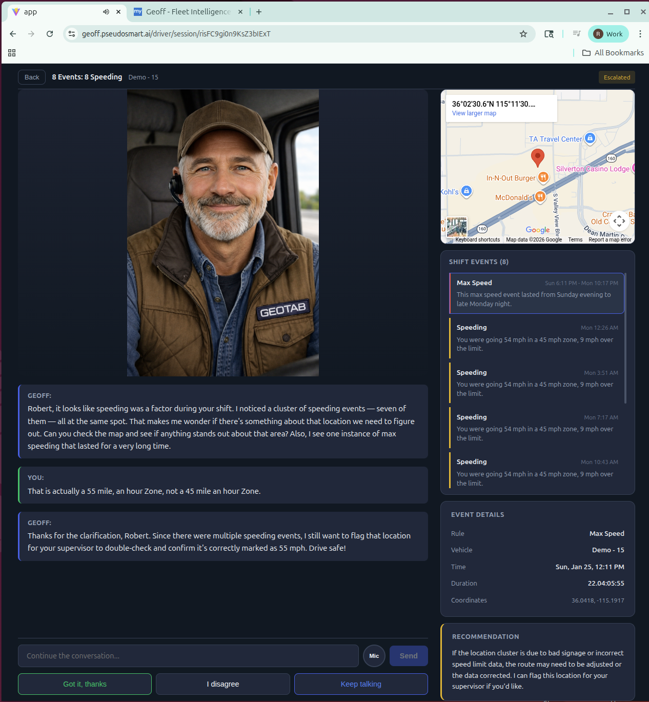
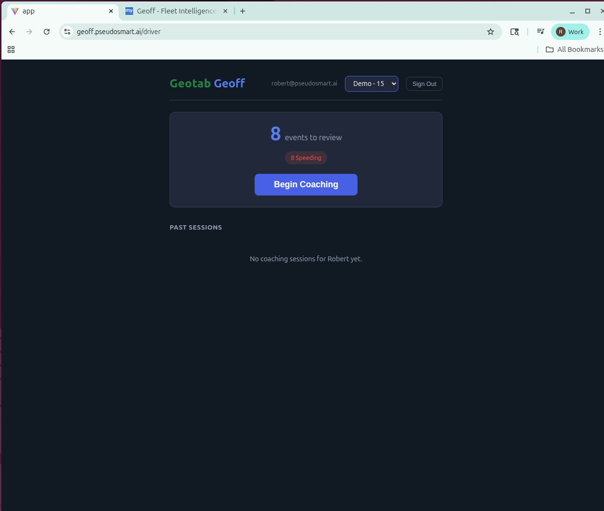
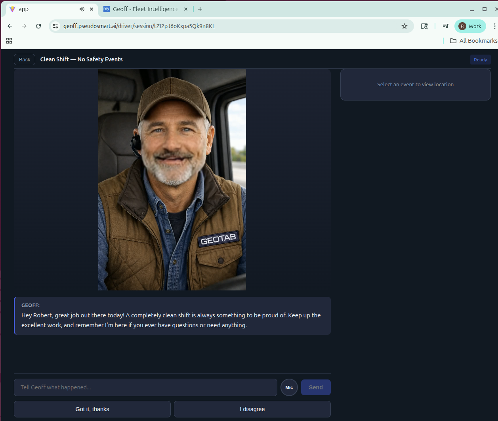
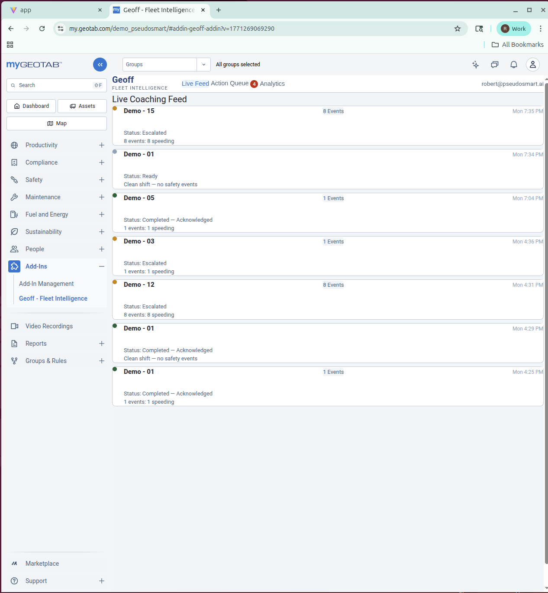
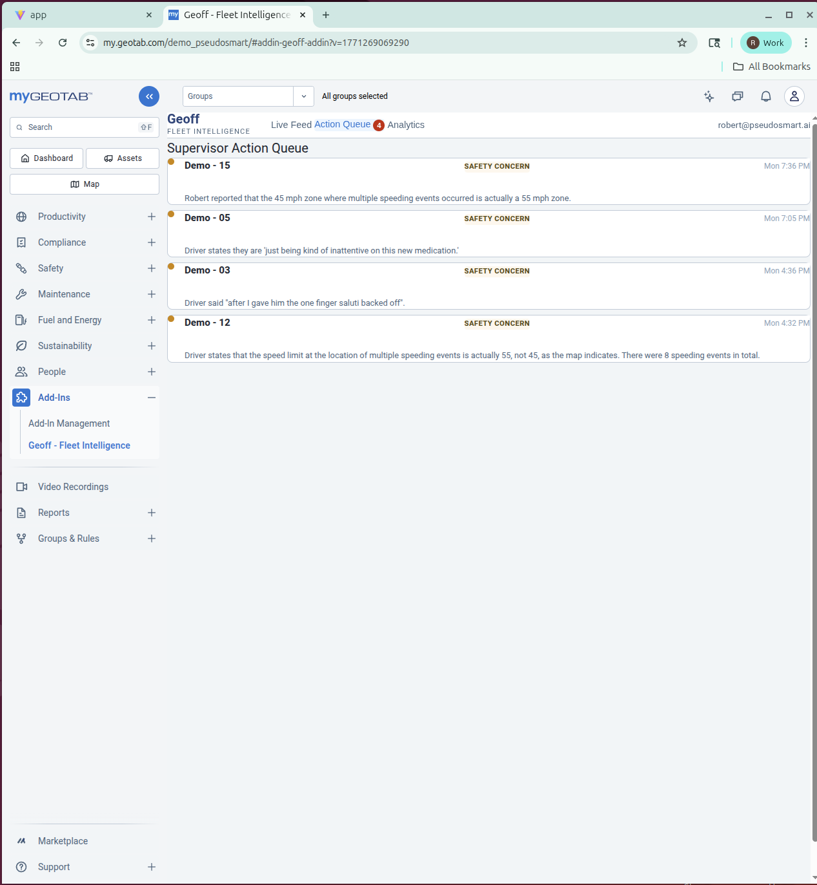
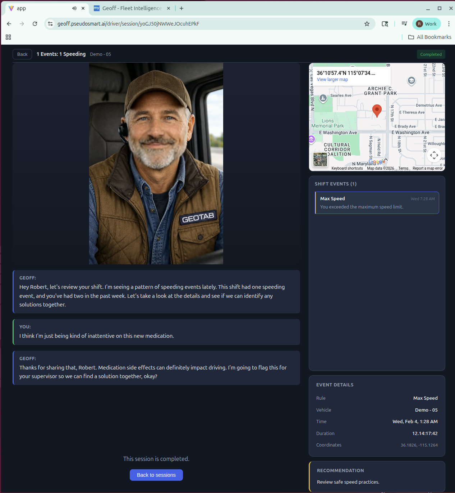

# Geotab Geoff — AI Fleet Safety Coach

[](https://github.com/robertlagrasse/geotab-geoff/actions/workflows/ci.yml)

<p align="center">
  
</p>

**Geoff coaches every driver, after every shift, about every safety event.** Not with a report. Not with an email. With a real conversation.

**Demo video:** [Watch on YouTube](https://youtu.be/-KtFKp8wk-M)

<p align="center">
  
  <br><em>Geoff reviews a driver's shift — identifying a cluster of speeding events at one location, with map context and event details</em>
</p>

---

## The Problem

Fleet safety managers are responsible for coaching hundreds — sometimes thousands — of drivers. But real coaching takes time: a one-on-one conversation about what happened on the road today. Most fleets can only coach a fraction of their drivers, usually after something's already gone wrong. The rest get a report they never read.

Most fleet safety tools try to solve this by building better scoreboards — gathering data, ranking drivers, and telling supervisors where to focus. That helps prioritize, but it doesn't scale. The supervisor is still the bottleneck. A safety manager coaching 5-10 drivers per week out of 200 is doing triage, not coaching.

## The Insight: What Speech Analytics Did for Contact Centers

Contact centers had the same structural problem. QA analysts could manually review 8-20 calls per day. With thousands of daily interactions, only **1-2% of calls were ever monitored** — [98% went completely unreviewed](https://www.ringcentral.com/us/en/blog/ai-quality-management-why-your-contact-center-cant-rely-only-on-manual-qa-anymore/). Feedback was delayed, decontextualized, and based on random samples.

Speech analytics changed everything. **100% of calls got analyzed automatically.** [QA staff was cut in half](https://callminer.com/blog/how-speech-analytics-can-reduce-costs-improve-contact-center-efficiency-case-study-examples) — and the remaining staff shifted from listening to calls to coaching agents on flagged interactions. The results:

- [HomeServe/Verint](https://www.verint.com/case-studies/homeserve-reduces-customer-effort/): 22% CSAT increase, **GBP 5M+ savings over 6 years**
- [Elavon](https://www.callcentrehelper.com/speech-analytics-where-is-the-best-return-on-investment-25773.htm): **$1.7M revenue retained in one quarter**
- Industry-wide: [15-25% customer satisfaction improvement](https://www.qevalpro.com/blog/agent-performance-management-kpis-proven-strategies/), [35% faster agent improvement cycles](https://www.qevalpro.com/blog/agent-performance-management-kpis-proven-strategies/)
- Gartner predicts conversational AI in contact centers will [reduce agent labor costs by $80 billion by 2026](https://www.gartner.com/en/newsroom/press-releases/2022-08-31-gartner-predicts-conversational-ai-will-reduce-contac)

## Geoff Is Speech Analytics for Fleet Safety

Geoff isn't a scoreboard that tells supervisors where to coach. **Geoff does the coaching.** Every driver, every shift, 100% coverage — the same leap from 1-2% to 100% that transformed contact centers. Supervisors don't review events; they handle the exceptions Geoff flags.

The result: every driver gets coached, every shift gets reviewed, and your safety team focuses on the cases that truly need a human touch.

### What It Costs

A typical coaching session — initial video coaching + two back-and-forth voice exchanges — costs approximately **$0.04** in cloud resources:

| Service | Per Session | What It Does |
|---------|-----------|--------------|
| Cloud Run GPU (NVIDIA L4) | $0.006 | 3 lip-synced videos (~10s GPU each) |
| Cloud TTS (Neural2) | $0.024 | 3 coaching responses (~500 chars each) |
| Gemini 2.0 Flash | $0.001 | 3 coaching generations (~2K input + 500 output tokens each) |
| Cloud STT (Enhanced) | $0.018 | 2 driver voice transcriptions (~10s each) |
| Firestore + Storage | <$0.001 | Session state, audio/video assets |
| **Total per session** | **~$0.05** | |

At 20 shifts per driver per month: **~$1.00/driver/month.**

For context: a human safety coach costs $40-60/hour. A typical coaching session — pull up the data, have the conversation, document the outcome — takes about 30 minutes, or **~$25/session**. That's **500x the cost of Geoff.** A 200-driver fleet coaching 10% of shifts needs 400 sessions/month at $25 = **$10,000/month for 10% coverage**. Geoff delivers 100% coverage for **$200/month**.

---

## How It Works

1. **Geotab GO devices** record safety events in real time — speeding, harsh braking, aggressive acceleration
2. **Geoff polls the Geotab API** using the official SDK, enriching each event with GPS coordinates, posted speed limits, and context from Geotab's Ace AI
3. **Shift-level analysis** — not event-by-event alerts. GPS clustering detects location patterns (e.g., four speeding events at the same intersection = a signage problem, not a driver problem)
4. **Gemini 2.0 Flash** generates a personalized coaching script for the driver's specific shift
5. **Cloud Text-to-Speech** synthesizes the script into natural speech
6. **Wav2Lip on Cloud Run GPU** generates a lip-synced video of Geoff delivering the coaching
7. **The driver talks back** — voice or text input drives a multi-turn conversation with Gemini
8. **Escalation system** evaluates every response against 7 safety triggers (road rage, impairment, intentional violations, hostility, vehicle defects, data severity, driver requests). Flagged sessions go to the supervisor action queue with full context

---

## Features

### Driver Experience
- Lip-synced avatar delivers coaching face-to-face, not as a wall of text
- Two-way voice conversation — drivers respond naturally and Geoff adapts
- End-of-shift holistic review with pattern detection across events
- Positive reinforcement on clean shifts (not just silence)

<p align="center">
  
  
  <br><em>Left: Driver selects a shift with 8 speeding events. Right: Geoff delivers positive reinforcement on a clean shift.</em>
</p>

### Supervisor Dashboard
- Real-time session feed with live status updates
- Action queue for escalated sessions — approve, deny, or discuss
- Fleet analytics via OData Data Connector
- Embedded as a **MyGeotab Add-In** so supervisors stay in their existing tool

<p align="center">
  
  
  <br><em>Supervisor dashboard embedded as a MyGeotab Add-In — Live Feed (left) and Action Queue (right)</em>
</p>

### Escalation Intelligence
- Three-tier system: data-driven (auto), conversation-driven (auto), driver-requested
- 7 boolean safety flags evaluated on every turn (aggressive driving, impairment, intentional violations, hostility, vehicle defects, data severity, driver requests)
- Server-side safety net forces escalation when flags fire, even if the model doesn't

<p align="center">
  
  <br><em>Escalation in action: driver mentions medication side effects, Geoff flags it for supervisor review</em>
</p>

### MCP Server
- 6-tool Model Context Protocol server for Claude Desktop integration
- Tools: `get_safety_events`, `get_fleet_kpis`, `get_driver_rankings`, `get_vehicle_details`, `get_driver_history`, `ask_ace`
- Enables conversational fleet management from any MCP-compatible AI assistant

---

## Architecture

```
┌─────────────────────────────────────────────────────────────┐
│  BROWSER — Firebase Hosting                                  │
│  ├── React + Vite                                            │
│  ├── Driver view: avatar coaching sessions (/driver)         │
│  ├── Supervisor view: dashboard + action queue (/dashboard)  │
│  └── MyGeotab Add-In: supervisor dashboard inside MyGeotab   │
└──────────────────────────┬──────────────────────────────────┘
                           │
┌──────────────────────────▼──────────────────────────────────┐
│  GCP BACKEND                                                 │
│  ├── Cloud Functions v2 (Node.js 20)                         │
│  │   ├── onSafetyEvent — Firestore trigger, auto-coaching     │
│  │   ├── beginCoaching — Ace context + Gemini script          │
│  │   ├── driverRespond — multi-turn conversation + escalation │
│  │   ├── ttsProxy — Cloud TTS + Wav2Lip video generation      │
│  │   ├── transcribe — Cloud Speech-to-Text                    │
│  │   ├── pollGeotabEvents — Geotab API → Firestore            │
│  │   ├── fleetAnalytics — OData Data Connector                │
│  │   └── geotabAuth — MyGeotab session → Firebase token       │
│  ├── Firestore (drivers, events, sessions, actions)           │
│  ├── Cloud Storage (audio, video, avatar assets)              │
│  ├── Vertex AI — Gemini 2.0 Flash                             │
│  └── Cloud Run + NVIDIA L4 GPU (Wav2Lip lipsync, us-east4)   │
│                                                               │
│  GEOTAB APIs                                                  │
│  ├── MyGeotab API (mg-api-js SDK v3.0.0)                      │
│  │   ├── ExceptionEvent, Driver, LogRecord                    │
│  │   └── GetRoadMaxSpeeds                                     │
│  ├── Ace AI (GetAceResults — pattern analysis + insights)     │
│  └── OData Data Connector (fleet-wide analytics)              │
│                                                               │
│  MCP SERVER (Python / FastMCP)                                │
│  └── 6 tools for Claude Desktop fleet management              │
└─────────────────────────────────────────────────────────────┘
```

## Tech Stack

| Layer | Technology |
|-------|-----------|
| Frontend | React + Vite, Firebase Hosting |
| Backend | Cloud Functions v2 (Node.js 20) |
| Database | Cloud Firestore (real-time listeners) |
| AI Coach | Gemini 2.0 Flash via Vertex AI |
| Text-to-Speech | Google Cloud TTS Neural2-D |
| Speech-to-Text | Google Cloud Speech-to-Text |
| Lip Sync | Wav2Lip on Cloud Run with NVIDIA L4 GPU |
| Geotab API | mg-api-js SDK v3.0.0 |
| Fleet Analytics | OData Data Connector |
| MCP Server | Python + FastMCP |
| MyGeotab Add-In | IIFE build, externally hosted |

---

## Geotab API Integration

Geoff uses **all three Geotab data channels**:

- **MyGeotab API** (via official SDK) — `ExceptionEvent`, `Driver`, `LogRecord`, `GetRoadMaxSpeeds` for real-time safety events and GPS context
- **Ace AI** — `GetAceResults` for natural language insights about driver history and fleet patterns, fed into coaching prompts
- **OData Data Connector** — fleet-wide KPIs and analytics for the supervisor dashboard

---

## Demo Video

**[Watch the full demo on YouTube](https://youtu.be/-KtFKp8wk-M)** — 3.5 minutes showing the complete driver coaching flow, escalation system, and MyGeotab supervisor dashboard.

**[My Name's Geoff](https://youtube.com/shorts/GTz1UZnx7T8)** — 9-second meme intro. Cloud TTS introduces Geotab, then Wav2Lip syncs Geoff to the iconic audio. Built in one conversation with Claude Code: yt-dlp extraction, audio trimming, TTS generation, lipsync pipeline, ffmpeg assembly.

## Geoff Explains (Video Series)

Geoff narrates his own deep dives — each video generated by the platform's own TTS + Wav2Lip pipeline:

**[Watch the playlist on YouTube](https://www.youtube.com/playlist?list=PLJc554ozx033qJkQ_TSEX_r5106JklITE)**

1. The Fleet Safety Coaching Problem
2. Speech Analytics: Stealing From Another Industry
3. How Geoff Works End-to-End
4. The Lipsync Pipeline
5. The Escalation System
6. Three Ways to Talk to Geotab
7. Vibe Coding: How AI Built an AI Coach
8. The $0.05 Coaching Session
9. Inside MyGeotab: The Supervisor Experience

### AI-Generated Podcast Series

Two-voice podcast episodes (Alex & Maya) generated via Cloud TTS Neural2 pipeline — 12 episodes, ~46 minutes total:

1. [The 18,920-Line First Commit](demos/podcast-18920-line-commit.mp3) (7:54)
2. [Steal From Another Industry](demos/podcast-02-steal-from-another-industry.mp3) (4:50)
3. [AI Evaluating AI](demos/podcast-03-ai-evaluating-ai.mp3) (3:15)
4. [Server-Side Safety Net](demos/podcast-04-server-side-safety-net.mp3) (3:37)
5. [MyGeotab Add-In Gotchas](demos/podcast-05-mygeotab-addin-gotchas.mp3) (3:50)
6. [Ace AI Integration](demos/podcast-06-ace-ai-integration.mp3) (3:35)
7. [OData Data Connector](demos/podcast-07-odata-data-connector.mp3) (3:13)
8. [Cloud Run GPU on a Budget](demos/podcast-08-cloud-run-gpu.mp3) (3:47)
9. [The Five-Cent Pipeline](demos/podcast-09-five-cent-pipeline.mp3) (3:23)
10. [MCP Server Patterns](demos/podcast-10-mcp-server-patterns.mp3) (3:09)
11. [When to Correct the AI](demos/podcast-11-when-to-correct-the-ai.mp3) (3:33)
12. [Prompt to Multimedia](demos/podcast-12-prompt-to-multimedia.mp3) (3:33)

### NotebookLM Deep Dives

**[Watch the playlist on YouTube](https://youtube.com/playlist?list=PLJc554ozx031epUkMgx_jnIg7m3koczGl)**

AI-generated podcast-style explainers built from Geoff's scripts using Google NotebookLM:

- **The Fleet Safety Paradox** — Why more data hasn't made fleets safer, and the structural bottleneck AI can break
- **The 100% Coverage Playbook** — How Geoff delivers total fleet coverage at $0.05/session
- **How an AI Coach Works** — End-to-end architecture from Geotab GO device to coaching conversation
- **A Digital Persona's Story** — How Wav2Lip turns a static photo into a talking coach
- **AI: When to Ask for Help** — The escalation system — three tiers, seven flags, and why you can't trust the model alone
- **Unlocking Geotab Data** — MyGeotab API, Ace AI, and OData — three channels, one fleet picture
- **Vibe Coding: Human+AI** — How one developer and Claude Code built a production platform in 48 hours
- **The Five-Cent Coaching Session** — Per-service cost breakdown and the 500x advantage over human coaching
- **Designing for the Supervisor** — The MyGeotab Add-In, custom auth flow, and zero-disruption dashboard

---

## Project Structure

```
geoff/
├── app/                    # React frontend (Vite)
│   └── src/
│       ├── components/
│       │   ├── auth/       # Login, role selection
│       │   ├── driver/     # Coaching session, avatar, voice input
│       │   └── dashboard/  # Live feed, action queue, analytics
│       └── hooks/          # Auth, Geotab session management
├── functions/              # Cloud Functions v2 backend
│   ├── coaching/           # Gemini coaching generation + escalation
│   ├── geotab/             # API client, Ace AI, MyGeotab auth
│   ├── speech/             # TTS + STT
│   └── analytics/          # OData fleet analytics
├── mcp-server/             # MCP server for Claude Desktop
├── demos/                 # Demo videos and scripts
├── scripts/                # Seed data
└── VIBE_CODING_JOURNEY.md  # AI-assisted development process
```

---

## Getting Started

### Prerequisites
- Node.js 20+
- Firebase CLI (`npm i -g firebase-tools`)
- Geotab demo database credentials
- GCP project with Vertex AI, Cloud TTS, Cloud STT enabled

### Quick Start
```bash
# Clone and install
git clone https://github.com/robertlagrasse/geotab-geoff.git
cd geotab-geoff
cd functions && npm install && cd ..
cd app && npm install && cd ..

# Configure environment
cp .env.example functions/.env
# Edit functions/.env with your Geotab and GCP credentials

# Build and deploy
cd app && npm run build && cd ..
firebase deploy

# Poll Geotab for safety events
curl -s https://pollgeotabevents-pdqai5yj3a-uc.a.run.app
```

---

## Built With AI

This project was built entirely using AI-assisted development (vibe coding) with **Claude Code** (Claude Opus). See [VIBE_CODING_JOURNEY.md](VIBE_CODING_JOURNEY.md) for the full story of how AI tools shaped every aspect of the project — from architecture to implementation to this README.

### Competition Documents

- [EVALUATION.md](EVALUATION.md) — Detailed evaluation against the official judging criteria with specific evidence for every claim
- [VIBE_CODING_JOURNEY.md](VIBE_CODING_JOURNEY.md) — Full AI-assisted development story: prompts, iteration, collaboration anecdotes, git commit analysis
- [SCORING.md](SCORING.md) — Gap analysis and score tracking used during iterative optimization

### Guides

12 practical guides distilled from this project — [browse all guides](guides/):

- [The 18,920-Line First Commit](guides/01-the-18920-line-first-commit.md) — How to prompt for a full-stack architecture in one shot
- [MyGeotab Add-In Gotchas](guides/05-mygeotab-addin-gotchas.md) — 9 undocumented gotchas for Add-In developers
- [Ace AI Integration Patterns](guides/06-ace-ai-integration.md) — The 3-step async API and conversational context
- [Cloud Run GPU on a Budget](guides/08-cloud-run-gpu-on-a-budget.md) — Scale-to-zero GPU inference at ~$0.004/request
- [When to Correct the AI](guides/11-when-to-correct-the-ai.md) — The human judgment layer in vibe coding

---

## Community Contributions

Everything we learned building Geoff, we shared back. Guides, podcasts, code patterns — all open, all free.

**Geotab SDK Discussions** — First active contributor in years:
- [Project Showcase](https://github.com/Geotab/sdk/discussions/463) — Full architecture and API usage walkthrough
- [MyGeotab Add-In Gotchas](https://github.com/Geotab/sdk/discussions/464) — 9 undocumented issues with fixes and code examples
- [Guides + Podcasts for Participants](https://github.com/Geotab/sdk/discussions/465) — All 12 guides and 12 podcast episodes shared as competition resources

**Official Vibe Guide Repo** — [PR #81](https://github.com/fhoffa/geotab-vibe-guide/pull/81) contributed 9 guides to the competition's central resource hub, covering Geotab integration patterns, infrastructure decisions, and vibe coding process.

**Content Library** — 46 minutes of AI-generated podcast content, 12 comprehensive written guides, 9 "Geoff Explains" videos, and NotebookLM deep dives. All produced using the project's own AI pipelines. Total cost: ~$2 in TTS API calls.

---

## License

[MIT](LICENSE)
